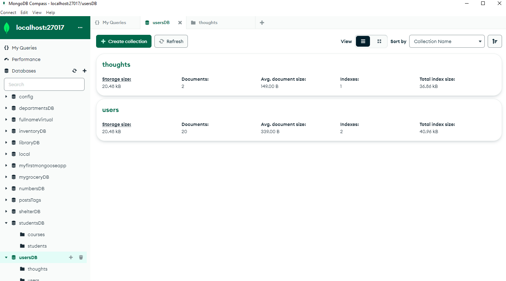
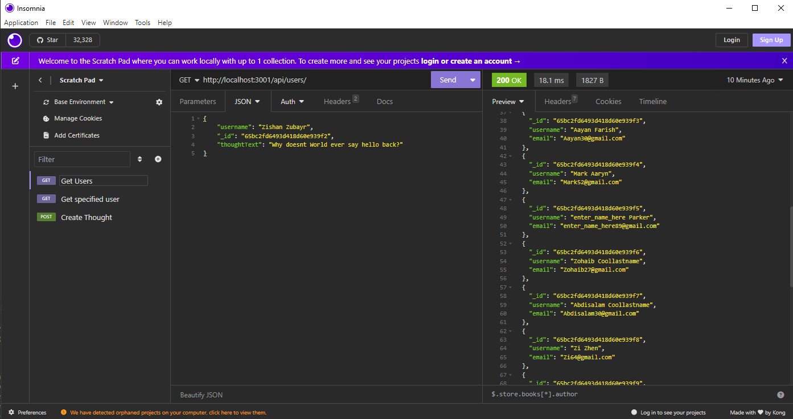

# Social Network Backend

## Description
    
Backend setup for a social media including a non relational database using MongoDB which can be interacted with using API's tested locally
    
## Table of Contents 
    
- [Installation](#installation)
- [Usage](#usage)
- [Questions](#questions)

## Usage
    
You can see the Mongo DB setup in MongoDB Compass and you can interact with the application using a local API scratchpad such as Insomnia or Postman
    

        
## Questions

If you have any questions, feel free to reach out to me at nate.mcmahon47@gmail.com or reference my GitHub:
[github.com/natemcmahon](github.com/natemcmahon)